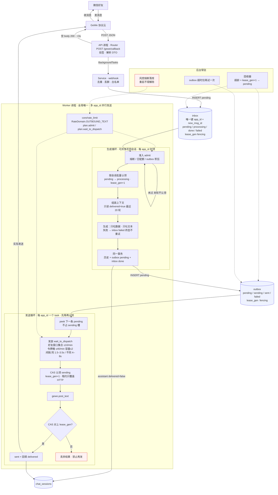

# P0 回复管道架构

> **状态：** 草案 v0.3（2026-09-11）。v0.3：账号上下线归 GeWe 后台；管道只消费回调/发送结果。补内部 `error_code` 闭集与 HTTP `AppException` 分层。
> 本文是回复管道的**唯一详情出处**。`decisions.md` 只记「为什么」，rules 只记「落点与可核对事实」，细节改动只改本文。

## 1. 目标与边界

长期运行、无 UI 的服务：GeWe 回调接入**多个执行节点**（多个本号 `wxid`），对**白名单个人好友**做纯文本自动回复。模型 `qwen3.8-flash`。

P0 就必须按多节点写：回调同时带 `wxid`（人）和 `appid`（当前槽）。会话、生成并发、发送串行按 `self_wxid` 隔离；`postText` 仍用 `nodes.current_app_id`。节点从回调学习，不建 env 花名册。白名单仍走环境变量。

**账号上下线不是本服务的职责。** 扫码、登录、掉线重连、解封在 GeWe 控制台完成。我们只有 Token 和回调。管道只消费信号：掉线类回调或发送返回离线/风控 → 该 `self_wxid` 准入失败并告警。不轮询 `checkOnline`，不自动 `reconnection`，不维护在线/离线状态机。**不要**把 GeWe 后台搬进本仓库。

**一期不做**：群回复、媒体下载/回看、Celery、Redis、AgentOS（不用其 session/memory/路由）、管理后台、账号生命周期（登录/重连/解封）。生成层已用 Agno `Agent`（见 §9、决策 0013）。
**一期不做**：长消息拆分（靠 system prompt + `max_tokens` 压短）。

> P2 的多媒体（图片/语音/视频）有独立的接收链路与限速域（回调只给 XML，需另调下载接口；下载须串行 + 3–10s 间隔；`fileUrl` 仅 7 天有效）。**约束已提前记录在 [`platform-limits.md`](./platform-limits.md) §6**，做 P2 前必读。

**语言**：统一用「生成」指调 LLM 产出文本，用「发送」指调 GeWe 真正发出去。二者是链路里性质不同的两半（见 §4）。

## 2. 四条硬约束

| 约束 | 来源 | 后果 |
|------|------|------|
| 回调 3 秒内返回 | GeWe 官方 | 回调里禁止 `await` LLM / 发送 |
| 同一执行节点**串行**发送，禁止并发 | GeWe 官方 | 发送必须队列化、单条 |
| **每分钟 ≤40 条**（硬顶）+ **不同好友 ≤10 位/分钟**（真正的安全线） | GeWe 官方 | 见下；发送必须带间隔与抖动 |
| 按 `appid + newMsgId` 去重（官方）；业务再加 `(self_wxid, new_msg_id)` | GeWe 官方 / 换槽 | 重复回调只处理一次 |

**速率是两条约束，别只看第一条。** 官方给了两个维度：

- **总量**：每分钟不超过 40 条。
- **不同好友数**：「同个时间段内频繁给多位好友发送消息，**即便是正常的聊天内容**，也会被限制聊天功能」，「**1 分钟超过 10–15 位好友**就会有风险」。

自动回复天然是**一条一条发给不同好友**（同一好友连发会 debounce 合并），所以「条数/分钟」≈「不同好友数/分钟」——**按 40/分钟跑等于对 40 位好友/分钟，是风险线的 2.7 倍**。详见 `platform-limits.md` §1。

**「3 秒响应」就是立即回空响应**（俗称走 ping，非独立探活接口）：文档口径为「3 秒内返回，可返回空字符串」。落地就是鉴权+解析后立刻 `status 200` + 空 body，不套 `{code,message,data}` 壳。去重/落库挂 `BackgroundTasks`，空 200 不表示已进 inbox。

**回调凭据只有一个：`Authorization` 头**，值为回调密钥原文（= `WEBHOOK_SECRET`，**无** `Bearer` 前缀，后端容错前缀）。**不要**用出站调 GeWe API 的 `X-GEWE-TOKEN` 去校验回调；body 里的 `token`（= `GEWE_TOKEN`）**不是**入站凭据。

**控制包按形状 ACK 空 200、不落库**（判定内联在 `app/api/v1/webhook.py` 路由里）：验证包 `{testMsg, token}`、订阅确认包 `{msg:"设置订阅成功!!", callBackUrl}`。两者都**不带** `Authorization`；若 401 掉，控制台「一键检测」会一直显示失败。放行**只是一个空转出口**——命中即 return，不进 `model_validate`、不挂后台任务，所以放行不等于接受内容；真正的防线是那条 `Authorization` 校验。

⚠️ **`Authorization` 是否下发由控制台的「Header Secret」决定，`setCallback` API 设不了**（实测参数被忽略）。改回调地址要用控制台——用 API 单独改 URL 会丢掉鉴权配置，导致消息被 401。

同一路径还要覆盖三类非业务请求，也必须空 200、不落库：

- **验证请求**：配置回调后 GeWe 会发一条 body 为 `{testMsg, token}` 的自检请求（Router 直接 ACK）
- **订阅确认包**：改回调地址后 GeWe 发 `{msg:"设置订阅成功!!", callBackUrl}`（无凭据）
- **系统事件**（官方回调 v2，**没有** `Offline`）：`LOGOUT` / `LOGIN_ERROR` / `LOGIN_SUCCESS` / `RECONNECT_SUCCESS` / `RECONNECT_FAIL` / `LONG_SUCCESS` / `LONG_FAIL` / `Long_Serve_Start_Success` / `Long_Serve_Close` / `SYSTEM`

**群判定（v2 扁平）**：`fromUser` / `toUser` 含 `@chatroom`，**或** `content` 以 `fromUser + ":\n"` 开头 → 丢弃，不落 inbox。后一种是线上常见形态：发言人在 `fromUser`、顶层没有群 ID；只认 `@chatroom` 会把群消息当成该好友的私聊并回复。

⚠️ **其它必知红线**（养号窗口、静默降权、账号/设备禁忌、多模态下载约束）不在本节展开，统一见 **[`platform-limits.md`](./platform-limits.md)**。改动限速、并发、多账号前必须先读它。

## 3. 分层

调用方向单向：`Router → Service → CRUD / utils`，`Worker → Service`。

| 层 | 职责 | 红线 |
|----|------|------|
| Router | 验签、解析 DTO、调 Service、立即返回 | 不碰 ORM、不调外呼、不写业务判断 |
| Service | 去重、丢群、白名单、状态迁移、编排 | 不直写 ORM、不定义路由、不实现闸门细节 |
| CRUD | 条件更新与 filter/create，返回 Model | 不做业务判断、不外呼 |
| `core/rate_limit` | 按 `RateDomain` 组装准入/发放 | 不认识 webhook / 生成事务；不调 GeWe |
| `core/exceptions.py` | HTTP `AppException` → `{code,message,data}` | 已落地；不进 webhook 成功路径；不进 worker |
| `core/gewe_errors.py` | 上游信封 → 内部 `error_code` | 只翻译，不抛给 FastAPI；Service 只看集合 |
| utils | `gewe_client`（httpx）、`generation`（生成接缝）| 无状态，不掺业务规则；GeWe 失败交给 `gewe_errors` |
| workers | 两个循环，只调 Service | 不直接 CRUD、不解析 HTTP、不手写限速 |

## 4. 并发模型（本设计的核心）

### 4.1 两个循环

Worker 里是**两个互不相干的循环**，性质相反，不要合并成一个。

| | 生成循环（消费 inbox） | 发送循环（驱动 outbox） |
|---|---|---|
| 做什么 | 准入 → 按会话认领 → 调 LLM → 建 outbox | peek → 发放等待 → CAS 认领 → `postText` |
| 对外可见 | **否**（只是到百炼的 HTTP 请求） | **是**（消息真的发出去了） |
| 并发 | 可并发**不同会话**（每 `self_wxid` 封顶 + 全局闸门） | **严格 1 条/执行节点**；账号间并行 |
| 失败 | LLM 一旦失败 → inbox `failed` **终态，不重试** | 超时只重试一次；风控走熔断，不走普通重试 |
| 租约 | 360s（> `GENERATION_TIMEOUT_SECONDS` 300s）；只覆盖「已认领、调用进行中」 | 60s；只覆盖 HTTP，**不含**发放等待 |

**为什么生成可以并发**：微信侧感知不到 LLM 调用；对外的节奏由发送间隔决定。把生成压成串行不会让账号更「像人」——让账号像人的是间隔与抖动——却会让第 n 个好友等 `n × LLM 延迟`，并把一次 LLM 卡顿放大为所有人的阻塞。

生成失败分两种，不要混：

- **崩溃 / 进程被杀**：行仍是 `processing`，回收器退回 `pending`（抬 `lease_gen`）。这是恢复，不是「失败后再跑一次」。
- **LLM 已经调用且失败**（429 / 超时 / 4xx）：标 `failed`，终态不可更改，**不重试**。少回一句，好过用同一批上下文把同一句再生成一遍。

并发度是**两级封顶**，不是「并发 vs 串行」：`INBOX_CONCURRENCY_GLOBAL`（跨节点总闸门）+ `INBOX_CONCURRENCY_PER_ACCOUNT`（每节点 2–3）。认领前先数该 `self_wxid` 的 in-flight 会话、再数全局；已满的账号本轮跳过。禁止写成「全局最老一条 LIMIT 1」却指望两级封顶自己生效。

落地是**调度器占槽，不是一条 `await process_one_batch` 串完全程**。Worker 用 `Semaphore(GLOBAL)` + `in_flight` 会话集合：有空槽才 `pick_next_session`，再 `create_task(process_session)`。debounce 和 LLM 只挡住这一路。禁止再写成单循环里串行 await。

### 4.2 三个旋钮的作用域各不相同

| 机制 | 作用域 | 为什么 |
|------|--------|--------|
| 发送串行 / 发放闸门 | **每 `self_wxid` + `RateDomain`** | 风控按微信号判定；下载/加好友以后是另一域 |
| 生成准入 / 生成并发 | 每 `self_wxid` 上限 **+** 全局闸门 | 准入挡空转；并发封顶是资源保护 |
| worker 实例数 | **全局唯一** | 令牌桶等内存态每进程一份；两实例 = 速率翻倍 |

**「串行」指按 `self_wxid` 串行，即账号内串行、账号间并行。**

- 风控作用域是单个微信号：40 条/分钟、同好友 1.5–3.5s 都是针对**一个登录态**的判定。A 号发得快不会让 B 号被降权。
- 所以全局串行是**零安全收益 + 纯延迟代价**。3 个账号各有一条待发、间隔均值 4.5s：全局串行要 ~13.5s，按节点并行只要 ~4.5s，且第三位省下的 ~9s 换不到任何东西——它自己的风控预算从头到尾没被碰过。
- 判据：取值 SQL 的 `NOT EXISTS` 子句必须带 `x.self_wxid = o.self_wxid`（§10）。写成全局判断就退化成全局串行。

注意第 1 行与第 3 行方向相反：**发送按节点分散，worker 实例必须全局唯一。**

### 4.3 进程模型：worker 独立且单实例

**部署不变量：API 可水平扩，worker 不行。** 多副本回调靠 inbox 唯一键去重；两个 worker = 两套内存桶 = 限速翻倍。

限速的**接口**按 `(self_wxid, domain)` 要许可，不按「当前进程里的那个桶」。内存桶只是 P0 实现；单实例是部署选择，不是 API 形状。由此得到两条硬约束。

**① worker 只能跑一个实例。** 两个 worker 进程 = 两个独立的桶 = 实际速率翻倍。systemd 通常不会重叠启动，但 Docker / K8s 滚动更新会（旧实例未退、新实例已起）。启动时用廉价保险锁死：

```sql
SELECT pg_try_advisory_lock(<常量A>, 1)   -- 拿不到 → 打明确错误并退出
```

不需要额外中间件，几行代码即可保证「同一时刻只有一个 worker 在发送」。

**单飞锁的四个实现约定**：

| # | 约定 | 原因 |
|---|------|------|
| 1 | **用 `try` 不用阻塞** | 抢不到就跳过/退出，绝不排队等。等锁会拖过 3 秒 ACK 窗口 |
| 2 | **acquire 与 unlock 必须 pin 同一底层连接** | session-level advisory lock 属于「会话」，而 Tortoise 的 `connections.get("default")` 只是池客户端，每次查询独立 acquire/release。需要 `pinned_connection()` 上下文持有同一 raw connection |
| 3 | **非 PG 直接放行，且不 pin** | 测试库若用 SQLite，持有其全局连接锁后再跑 ORM 会死锁。降级为「无锁 → yield True」 |
| 4 | **持锁期间 pin 占 1 个池连接** | 这是成本，要算进连接池大小。锁与业务 SQL 不必同连接（业务 SQL 走池） |

**键的规划（两把锁，两种粒度）**：

| 锁 | 键 | 粒度 | 用途 |
|----|----|------|------|
| worker 单实例 | `(常量A, 1)` | 全局 | 同一时刻只有一个 worker 在发送 |
| 每节点发送串行 | `(常量B, self_wxid)` | **每执行节点** | 可选加强；P0 已由 §10 的 SQL + 部分唯一索引保证，此锁用于将来到多进程时兜底 |

常量取固定整数（如 `88440101`、`88440102`），**禁止用文本键**；抽到 `app/core/locks.py` 统一管理，避免各业务各写一份。

**② 不要用 `uvicorn --workers N` 承接 worker。** 若把 worker 放进 FastAPI 的 `lifespan`，每个 uvicorn worker 都会跑一遍启动逻辑，于是每个执行节点会有 N 个 sender 循环、N 个桶——正好命中我们花整节去避免的风控条件。`make dev` 是单进程所以看不出问题，哪天有人为加 QPS 加上 `--workers 4`，就直接往封号方向走。独立进程从结构上消灭这类 bug。

**为什么 worker 独立于 API 进程**

因为队列表在 Postgres 里，把 worker 塞进 API 进程**不能省掉任何一次 DB 往返**——回调必须写库、worker 必须读库，这条往返无论如何都在。同进程唯一的好处是少管一个进程，却换四个风险：

| 风险 | 后果 |
|------|------|
| `--workers N` 放大限速 | 每节点 N 个桶，速率翻倍 |
| 3 秒 ACK 与 worker 健康绑定 | 单事件循环里任何非 await 阻塞段都会推迟 ACK；而 GeWe 超时不补投 |
| 健康检查被饿死 | 卡住的 LLM 调用拖住 `/health` → 编排器误判 API 挂了 → 重启 → 打死在途回调 |
| 生命周期耦合 | 改一句 prompt 就要重启，每次都冒一次 3 秒 ACK 窗口的风险 |

**不要**用「同进程 + 另起一个 loop 放线程」这种折中：asyncpg 连接绑定在创建它的 event loop 上，等于既没有崩溃隔离，又要养两个连接池，跨 loop 误用会抛出极难定位的错误。

worker 内部的两个循环**共用 worker 自己的那一个事件循环**，两个 asyncio task 即可——都是纯 async 低量级，`await asyncio.sleep(3)` 会正常让出控制权。这个选择可逆：两者只通过 DB 交互，将来要把发送拆成第三个进程零成本。

落地入口（`main.py` 的 lifespan 保持只管 Tortoise，**不要**往里加 worker 启动逻辑）：

```
app/workers/reply.py   # asyncio.run(main())；自己 Tortoise.init；自己接 SIGTERM 做 drain；启动先抢 advisory lock
Makefile               # dev / worker 两个 target
```

## 5. 数据模型

五张表。**inbox / outbox / chat_sessions 三者分工不同，不要互相派生。** `nodes` 只做人 ↔ 当前槽 + 熔断，不是账户中心。

### 5.1 inbox — 入站投递状态机

| 字段 | 说明 |
|------|------|
| `id` | 自增，兼作顺序 |
| `self_wxid` | 执行节点（本号微信号） |
| `app_id` | 当次 GeWe 槽快照，不当会话键 |
| `friend_wxid` | 好友 |
| `new_msg_id` | GeWe 消息 ID（**字符串**，可能 > 2^53） |
| `content` | 文本；**媒体消息为 NULL**（源 XML 在 `media.source`，文本占位由 media 派生，见 §5.5） |
| `status` | `pending / processing / done / failed`（无 `ignored`：群/验证包/系统事件**不落库**） |
| `attempt` | 本行已认领次数（崩溃回收会 +1；**不是**「LLM 失败再试」——失败进终态） |
| `lease_gen` | 租约代次；每次认领 / 回收 +1。回写必须 CAS 对上代次 |
| `leased_until` | 租约到期时间，回收器依据 |
| `claimed_at` | 认领时刻（SQL `NOW()`）。排队 = `claimed_at - created_at` |
| `worker_id` | 认领者，便于排障 |
| `error_code` | 内部错误码（短、可枚举、**用于判可重试**） |
| `error_message` | 失败详情（截断 500，排障用；对用户无意义） |
| `created_at` | 到达时间 |
| `updated_at` | 最后更新时间；**心跳来源**（见 §5.9） |

唯一约束两道：`(self_wxid, new_msg_id)` 防换槽重放；`(app_id, new_msg_id)` 对齐官方同槽去重。靠数据库约束而非应用层查重。

**错误信息分两列**：`error_code` 是短且封闭的枚举，代码据此判断「能不能重试」；`error_message` 只作排障，**要截断**（`[:500]`）且不对外暴露原始上游错误。不要用一列自由文本兼做判断依据。

### 5.2 outbox — 出站发送状态机

| 字段 | 说明 |
|------|------|
| `id` / `self_wxid` / `friend_wxid` | 节点隔离键是本号；`app_id` 可空，CAS 认领时写入当时的 `nodes.current_app_id` |
| `content` | 待发文本 |
| `source_inbox_ids` | 本条回复由哪些入站消息生成（审计用） |
| `status` | `pending / sending / sent / failed` |
| `attempt` | 已发送尝试次数（超时那一次计入；到 `SEND_MAX_ATTEMPTS` 进终态，P0=2 含首次） |
| `lease_gen` | 租约代次；每次认领 / 回收 +1。标 `sent` 必须 CAS 对上，对不上则丢弃 HTTP 结果、禁止再发 |
| `leased_until` | 只覆盖 `postText` HTTP，**不含**发放等待（§10） |
| `error_code` / `error_message` | 同 inbox；`error_code` 决定可重试性 |
| `external_id` | GeWe 发送成功后返回的 **`newMsgId`（字符串）**；对账用，不是防重发 |
| `next_retry_at` | 发送超时那一次的到期时间 |
| `sending_at` | 进入 `sending` 的时刻（只写第一次：`COALESCE(sending_at, NOW())`）。本次 HTTP 耗时打日志，不要用重试覆盖后的差值 |
| `created_at` / `sent_at` / `updated_at` | |

**`external_id` 取 `newMsgId`，不取 `msgId`**（已核实 GeWe 文档）：

`postText` 成功响应为 `{ret, msg, data}`，`data` 含 `toWxid / createTime / msgId / newMsgId / type`。取值要点：

- 用 **`newMsgId`**——官方口径「NewMsgId 才是唯一ID」，`msgId` 是旧 ID（示例中为 `0`，可能为空）。
- **按字符串处理**：官方示例 `newMsgId: 3768973957878705000` 已超过 2^53，JSON 数值会丢精度。
- 它的用途是**对账**（不是防重发）：发送超时无法确认是否送达时，这是唯一可查的线索。

**关于 `external_id`**：已核实 `postText` 返回 `newMsgId`（见上），因此**该列要建**，发送成功时写入。

**部分唯一索引：每执行节点同时只许一条 `sending`。**

```sql
CREATE UNIQUE INDEX uniq_outbox_sending_per_account
    ON outbox (self_wxid) WHERE status = 'sending';
```

为什么需要它：仅靠 §10 的 `NOT EXISTS` 在并发下不严密——T1 把 row1 改成 `sending` 但**尚未提交**时，T2 在 read committed 下读不到这个未提交状态，可能同时把 row2 也改成 `sending`。P0 因「每节点一个 sender task + worker 单实例」（§4.3）不会暴露，但那是**靠调用顺序假设，不是靠约束**。这条索引把约束下沉到数据库：第二个并发认领直接唯一键冲突、自动失败。只覆盖 `sending` 那几行，索引很小。

### 5.3 chat_sessions — 会话历史

一行 = 一个本号↔好友。`messages` 是 JSONB 数组，不是逐条消息行。

| 字段 | 说明 |
|------|------|
| `id` | PK |
| `self_wxid` / `friend_wxid` | **UNIQUE**，会话键 |
| `messages` | JSONB 数组。元素：`role` / `content` / `delivered` / `at` |
| `created_at` / `updated_at` | 改 blob 必刷 `updated_at` |

元素：`user` 写入即 `delivered=true`；`assistant` 生成时 `false`，outbox 标 `sent` 后回填最后一条未送达 assistant。

**两层窗口**：库内最多 `CHAT_STORE_ROUNDS=200` 轮（400 个元素），超出 SQL 从队头按整轮丢掉；给模型仍 `REPLY_HISTORY_ROUNDS=20`。读热路径用 `jsonb_array_elements … ORDER BY n DESC LIMIT 20*2+2`，不 `SELECT` 整列。写热路径 `messages \|\| pair`，超长在 SQL 截断。列表/巡检禁止选 `messages`（TOAST）。

**为什么独立于队列表**：inbox 是投递状态、outbox 是发送状态，二者都不是聊天记录。混用会导致失败重试污染上下文、状态字段与内容纠缠、以后加多模态要改队列表。

**媒体（图片已落地）**：`content` 永远是字符串占位（如 `[图片]`），文本组装按行渲染（媒体行取 `media.render`，见 §5.5）。回调 XML、`fileUrl`、取用状态**都不进会话 JSON**；媒体源在 `media.source`。截断按整轮元素，不按字节。webhook 放行 `TEXT` 与 `IMAGE`。

### 5.4 nodes / allowlist

节点**不**走 env 花名册。合格私聊回调 upsert `nodes`（`self_wxid` ↔ `current_app_id`）。白名单仍 env：

```
GEWE_ALLOWLIST=                          # 空 = 功能关（过群/gh_/isSelf 后都回）
# 非空 = 本号wxid:好友|好友,... ；某个本号没出现 = 该号不回
```

`allowlist` 语义是 `(self_wxid, friend_wxid)`。功能关时这个 Token 下合格私聊都会建节点。

`nodes` 字段：`id` PK、`self_wxid` UNIQUE、`current_app_id` UNIQUE、`circuit_open_until` / `circuit_reason`（可空）、`created_at` / `updated_at`。换槽覆盖钥匙，**不自动关熔断**。不存是否在线，不轮询 `checkOnline`。

发送间隔、好友窗口、日配额 **全部查 outbox**，按 `self_wxid`：

- 间隔：该号最近一条 `sent` 的 `(friend_wxid, sent_at)`
- 好友窗口：`sent_at` 落在最近 60s 的 distinct `friend_wxid`
- 日配额：该号当日 `status='sent'` 行数（日历日用业务时区，见 §5.8）

### 5.5 media — 媒体获取状态机（图片已落地）

一行 = 一条入站媒体，1:1 挂在 `inbox` 上。**独立于 inbox**：媒体有自己的生命周期（待取 → 就绪/失败/跳过）、自己的限速域（下载消耗账号会话）与自己的重试语义，混进队列表会让两套状态机互相干扰。

| 字段 | 说明 |
|------|------|
| `inbox_id` | FK→inbox，UNIQUE。溯源用；幂等仍靠 inbox 唯一键 |
| `self_wxid` / `friend_wxid` | 冗余：下载队列按账号限速与扫表用，避免 join |
| `media_type` | `image` / `voice` / `video` |
| `status` | `pending / ready / failed / skipped` |
| `source` | 取媒体所需原始参数（JSONB）。image → `{"xml": "<msg>…</msg>"}`；voice 另需 `msg_id` |
| `asset_ref` | 取到的资源引用：上游 URL（P0）或自有存储路径；语音可放转码后的 mp3 |
| `text_repr` | 媒体的文本化（如语音 ASR 结果），有值时并入上下文 |
| `attempt` / `error_code` / `error_message` | 排障与配额统计 |

三个输出通道（`asset_ref` / `text_repr`）足以覆盖三种媒体，新增类型不用改表。

**为什么不要租约列**：下载循环跑在 worker 内，worker 已持全局 `pg_try_advisory_lock` 单飞 + 账号内串行，没有并发认领。崩溃留下的 `pending` 下一轮自然重取。将来真要多下载实例再补 `leased_until`。

**defer 与解除**：`peek_next_session` 排除「本会话还有 `pending` 媒体」的会话，保证带图回复；此外**媒体全部解析完之后还要按住一个静默窗**（`MEDIA_QUIET_MS=10000`，`app/core/queue_constants.py`），把下载期间用户补发的问题收进同一批，避免图文被拆成两轮各自回复。文本侧认领是相邻间隔滑窗（间隔 ≤ `DEBOUNCE_MS` 并批）；媒体静默只在 peek 按住整场，不参与切断。解除还有第二重阀门：媒体超时翻 `failed`（`fail_stale`）。

**`fail_stale` 必须区分「排队」与「卡死」**（决策 0014）：按 `attempt` 判定——`attempt > 0`（已发起下载未收终态）按 `MEDIA_ATTEMPT_TIMEOUT_SECONDS=30` 判卡死；`attempt = 0`（仍在排队）按 `MEDIA_QUEUE_TIMEOUT_SECONDS=420` 判排队上限。若只按 `created_at` 绝对年龄判死，串行下载下第 6 张起就会被误判（30 张积压需约 200s），有效容量被压到约 5 张。`mark_ready`/`mark_failed`/`mark_skipped` 的时间戳一律走 DB `NOW()`，与窗口判定同源。

### 5.6 索引按访问路径设计

每个索引都要对应一条真实查询，不建「以防万一」的索引：

| 表 | 索引 | 服务的查询 |
|----|------|------------|
| nodes | `self_wxid` **UNIQUE** | 人 → 当前槽 |
| nodes | `current_app_id` **UNIQUE** | 系统事件反查 |
| inbox | `(self_wxid, new_msg_id)` **UNIQUE** | 业务去重（换槽不重放） |
| inbox | `(app_id, new_msg_id)` **UNIQUE** | 官方同槽去重 |
| inbox | `(status, id)` | 认领：找最老的 pending |
| inbox | `(self_wxid, friend_wxid, status, id)` | 按会话批量认领 |
| inbox | `(status, leased_until)` | 回收器扫超龄 `processing` |
| outbox | `(self_wxid, status, id)` | 按节点取待发 |
| outbox | `(status, leased_until)` | 回收器扫超龄 `sending` |
| outbox | `(self_wxid, sent_at)` | 发放：好友窗口 / 间隔 / 日配额（§8） |
| outbox | `(self_wxid) WHERE status='sending'` **UNIQUE** | 每节点单条 in-flight（§5 上文） |
| outbox | `(next_retry_at)` 部分索引 `WHERE status='pending'` | 发送超时那一次的到期重试 |
| chat_sessions | `(self_wxid, friend_wxid)` **UNIQUE** | 一会话一行；读尾 / 写拼接都靠主键 |

`(status, leased_until)` 正是给清扫器/回收器用的那条。

### 5.7 状态机纪律

状态迁移**只能经 Service**，CRUD 只做条件更新。四条纪律直接决定并发正确性：

**① 终态/非终态用集合表达，不散落判断。**

```python
INBOX_TERMINAL = frozenset({"done", "failed"})
INBOX_NON_TERMINAL = frozenset({"pending", "processing"})
OUTBOX_TERMINAL = frozenset({"sent", "failed"})
```

每次条件更新传集合，而不是在各处写 `if status == "done"`。

**② 条件更新（CAS）用影响行数判断自己是否抢到。**

```python
rows = await outbox_crud.update_fields_if(
    outbox_id,
    match={"status": "sending", "lease_gen": claimed_gen},
    fields={"status": "sent", "sent_at": now, "updated_at": now},
)
if rows == 0:
    # 租约已被回收或状态已变 → 丢弃结果，禁止再发
    ...
```

CRUD 签名以条件更新返回 rowcount 为准。**不允许**「先查状态再无条件写」——那是竞态。标 `sent` 必须带 `lease_gen`。

**③ 不能用 status 表达业务阶段。** 过程信息放 `phase` / `attempt` / 计数等独立列，或另一张表。这条正是我们把 inbox 与 outbox 拆开的原因之一：不要给 inbox 加「已生成待发送」这种状态。

**④ 终态钩子失败不许回滚主状态**。例如发送成功后要回填会话里最后一条 assistant 的 `delivered`：

```python
async def _safe_after_sent(outbox_id) -> None:
    try:
        await ...
    except Exception:
        logger.exception("outbox.post_sent_hook_failed", outbox_id=outbox_id)
```

**不能因为副作用失败就把已经发出去的消息标成 `failed`**——那会导致重发、真的重复回复。

### 5.8 时间与时区（重要陷阱）

**内部时刻一律 aware UTC。** `utcnow()` 返回 `datetime.now(UTC)`，禁止 `.replace(tzinfo=None)`。`TORTOISE_ORM` 显式 `use_tz=True, timezone="UTC"`（Tortoise 1.x 默认已是如此；0.25 默认 `False`，不要把 0.25 的 naive 时区故事抄过来）。PG 列是 `TIMESTAMPTZ`。比较前用 `as_utc()`：naive 当 UTC 墙钟补 tz，已 aware 则 `astimezone(UTC)`。**禁止剥 tz。**

往 `DatetimeField` 写 naive 会触发 `RuntimeWarning: received a naive datetime while time zone support is active`，Tortoise 再按 UTC `make_aware`。警告不是噪音，是两套约定撞车。

**红线：租约与超时比较一律在 SQL 里做**（`NOW()` vs `timestamptz`），不要把回收逻辑搬进 Python。这与时钟是否 aware 无关，是「比较留在 DB」的纪律。

**限速/租约列的写入也走 DB `NOW()`。** `sent_at` / `sending_at` / `next_retry_at` / `leased_until` / `claimed_at` 禁止再写 `utcnow()`，否则会和窗口 SQL 混钟（好友数闸门被放宽、`sent_at < sending_at`）。间隔闸门用 SQL `EXTRACT(EPOCH FROM (NOW() - sent_at))`，不要 `datetime.now(UTC) - sent_at`。`utcnow()` 只留给熔断这种「Python 写、Python 比」的值。

```sql
-- ✅ 对：DB 侧比较，不经过 Python
UPDATE inbox SET status='pending', leased_until=NULL
WHERE status='processing' AND leased_until < now();
```

```python
-- ❌ 错：回收不该在 Python 里扫过期行
cutoff = utcnow() - timedelta(seconds=LEASE_SECONDS)
await Inbox.filter(leased_until__lt=cutoff).update(status="pending")
```

熔断截止这类**必须**在 Python 比的瞬间：双方都走 `utcnow()` / `as_utc()`，不要 `_naive()`。发送间隔的 elapsed 已经在 SQL 里算好，闸门不要再拿 app 钟减 `sent_at`。

另有一条同源陷阱：**Tortoise 的 `QuerySet.update()` 不会触发 `auto_now`**，所以条件更新必须显式带 `updated_at`：

```python
fields = {**fields, "updated_at": utcnow()}
```

**日配额的「今天」**：业务时区固定 `Asia/Shanghai`（`QUOTA_TZ`），在 SQL 里用 `(sent_at AT TIME ZONE 'Asia/Shanghai')::date = (now() AT TIME ZONE 'Asia/Shanghai')::date`。不要用 UTC 自然日切，也不要把 `QUOTA_TZ` 改成 UTC。

### 5.9 `updated_at` 兼作心跳

有的队列用 `updated_at` 当隐式心跳：活着的任务每次进度更新都会刷新它，只有真卡死才停留在旧值，从而减少误杀慢任务。

我们**主用显式 `leased_until`**（因为要「退回 pending 重试」而非「判死」，且 LLM 时长需要精确 deadline），但吸收它两点：

- **阈值按类型动态取**（我们已做：由 `LLM_TIMEOUT` 推导），不要写死魔数。
- **加宽限期避免误杀**：判超龄应是 `leased_until + 宽限 < now()`，给「刚超一点点」留余量，而不是卡在边界。宽限可取 30–60s，因为 LLM 超时已明确。

将来 P4 上多步 Agent、总时长不确定时，可以叠加真心跳（长任务中途刷新 `leased_until`）。P0 不需要。

## 6. 端到端数据流

以某好友连发三条为例。

| 步骤 | 执行者 | inbox | chat_sessions | outbox |
|------|--------|-------|---------------|--------|
| ① 回调到达：鉴权、解析，立刻空 200 | Router | — | — | — |
| ② BackgroundTasks 去重/丢群/白名单后落库 | Service | +3 `pending` | — | — |
| ③ 准入（熔断 / 日配额 / 积压） | 生成循环 | 未过则本轮不认领 | — | — |
| ④ 认领该会话批次 | 生成循环 | 3 → `processing` | — | — |
| ⑤ 组装（只取 `delivered=true`）→ LLM → 事务提交 | Service/reply | 3 → `done` | append 一轮 user(true)+assistant(false) | +1 `pending` |
| ⑥ peek → 发放等待 → CAS 认领 → `postText` | 发送循环 | — | — | `sending` → `sent` |
| ⑦ 回填 `delivered=true` | 发送循环 | — | assistant 可见 | — |

第 ⑤ 步是**一个事务**：写历史 + 建 outbox + 标 inbox 完成，三者同生共死。否则会出现「回复写进历史但 outbox 没建」的丢消息。assistant 元素带着 `delivered=false` 进 JSON，**下一轮组装看不见它**；只有第 ⑦ 步成功后才进入上下文。

## 7. inbox 认领：按会话批量，不按消息

一次改动同时得到三样东西：同会话串行、连续消息合并（debounce）、顺序正确。

认领前先过**生成准入**（§8.0）：该 `self_wxid` 熔断中、日配额已满、或 outbox pending 超过积压上限 → **跳过该号，继续 peek 下一个**，不要让整个生成循环去睡。准入不过等于「先别花钱生成」，不是发送失败。

认领还要满足两级并发：该 `self_wxid` 当前 `processing` 会话数 `< INBOX_CONCURRENCY_PER_ACCOUNT`，全局 `< INBOX_CONCURRENCY_GLOBAL`。已满的账号跳过，找下一个。

```sql
-- 1) 找最老的、所在账号尚未满员、且该会话没有 processing 行的 pending 会话
SELECT i.self_wxid, i.friend_wxid, MIN(i.id) AS first_id
FROM inbox i
WHERE i.status = 'pending'
  AND NOT EXISTS (
    SELECT 1 FROM inbox p
    WHERE p.self_wxid = i.self_wxid AND p.friend_wxid = i.friend_wxid
      AND p.status = 'processing'
  )
  AND (SELECT COUNT(DISTINCT friend_wxid) FROM inbox p
       WHERE p.self_wxid = i.self_wxid AND p.status = 'processing')
      < $INBOX_CONCURRENCY_PER_ACCOUNT
GROUP BY i.self_wxid, i.friend_wxid
ORDER BY first_id
LIMIT 1;

-- 2) 首次认领：会话已有 processing 则空手；DEBOUNCE_MS>0 时只收相邻间隔 ≤ 窗宽的第一段链
--    事务内先 pg_advisory_xact_lock(hashtext(self_wxid))，账号上限在此权威判定
UPDATE inbox
SET status='processing',
    leased_until=now()+interval '360s',
    lease_gen=lease_gen+1,
    attempt=attempt+1,
    claimed_at=now(),
    worker_id=$me
WHERE id IN (
  SELECT id FROM inbox
  WHERE status='pending' AND self_wxid=$1 AND friend_wxid=$2
    AND NOT EXISTS (
      SELECT 1 FROM inbox p
      WHERE p.self_wxid=$1 AND p.friend_wxid=$2 AND p.status='processing'
    )
    AND (
      SELECT COUNT(DISTINCT o.friend_wxid) FROM inbox o
      WHERE o.self_wxid=$1 AND o.status='processing' AND o.friend_wxid <> $2
    ) < $INBOX_CONCURRENCY_PER_ACCOUNT
    -- 滑窗：从最早 pending 起，下一条与上一条时差超过 DEBOUNCE_MS 就切断
  ORDER BY id LIMIT 10
)
RETURNING *;
```

- **同会话自动串行**：peek / 首次 claim 都排除已有 `processing` 的会话；debounce 补领（`claim_more_same_session`）不带这条，否则连发合并会废。调度器的 `in_flight` 挡住 pick→claim 窗口。**不需要另加 per-session 锁。**
- **debounce 是相邻间隔滑窗，不是「首条 + 10s」固定窗**：首次 claim 收「从最早 pending 起、相邻间隔 ≤ `DEBOUNCE_MS`」的第一段链；补领前睡到**当前批最后一条** `+ DEBOUNCE_MS`，再按同一规则接链。新消息只要跟上一条间隔不超过窗宽，就把右界往后推。睡眠时长用 DB `NOW()` 算剩余（`seconds_until`），不要用 app 侧时钟。中间裂开超过窗宽的两条**不会**合成一句——即便它们各自都还在排队。
- **账号并发上限在认领这一层再判一次**：`peek` 的计数到 `claim` 之间有一次 DB 往返，
  仅靠 `peek` 会放过第 N+1 个会话；认领事务内先取 `pg_advisory_xact_lock(hashtext(self_wxid))`
  再按 `COUNT(DISTINCT friend_wxid) < INBOX_CONCURRENCY_PER_ACCOUNT` 判定，
  并发认领因此串行化，看到的是对方已提交的结果。
- **终态回写按 `(id, lease_gen)` 成对匹配，并校验行数**：同批各行的代次可能不同
  （首次认领与补领各自 +1），故用 `unnest(ids, gens)` 成对匹配；行数对不上说明租约已被回收/接管，
  **整批事务回滚**（`StaleLeaseError`），交给新持有者重新生成，避免重复回复。只用 `status='processing'`
  判断挡不住「回收后又被重新认领」这条路径。
- **顺序正确**：批内按 `id` 排序即到达顺序。
- **处理期间新来的消息**保持 `pending`，由补领或下一轮 `process_session` 收。
- **`attempt` 只记录认领次数**（崩溃回收会增加）。LLM 一旦返回失败，标 `failed`，不再用 `attempt` 决定「再试一次」。

## 8. 限速：准入与发放，按域组装

限速回答两个不同时机的问题，不要揉进 `outbound.py` 一段 inline 流程。

- **准入**问的是：现在该不该花钱去生成。熔断、日配额、outbox 积压。过不了 → 本轮不认领 inbox。
- **发放**问的是：这条已经生成的回复现在能不能发出去。好友窗口、令牌桶、间隔。过不了 → **先等，再认领**，绝不占着 `sending` 睡觉。

作用域永远是 `(self_wxid, RateDomain)`。P0 只有一个域 `OUTBOUND_TEXT`。P2 下载、P3 群、加好友各自注册自己的 Plan，**禁止复用发送桶**。

### 8.0 落点与接口（防屎山）

```
app/core/rate_limit/
  domain.py        # RateDomain = OUTBOUND_TEXT | DOWNLOAD | ADD_FRIEND | GROUP_TEXT
  intent.py        # SendIntent(self_wxid, friend_wxid, domain)
  plan.py          # RatePlan.admit(intent) / RatePlan.wait_to_dispatch(intent)
  registry.py      # for_account(self_wxid, domain) → 该节点该域的 Plan
  gates/
    circuit.py           # 熔断（落库截止时间）
    daily_quota.py       # 日配额（查 outbox sent）
    backlog.py           # outbox pending 上限
    distinct_friends.py  # 滑动窗口，去重集合
    token_bucket.py      # 手写内存桶，容量小
    interval.py          # 上一条 sent 的好友 + 时间
```

Service / worker 只准看见这两句：

```python
plan = registry.for_account(self_wxid, RateDomain.OUTBOUND_TEXT)
await plan.admit(intent)  # 生成循环：False → 本轮不认领
delay = await plan.wait_to_dispatch(intent)  # 发送循环：算出还要睡多久
```

换一种限速（群 2–5s、下载 3–10s）只加 Gate、注册进该域的 Plan。若要改 webhook、inbox 认领、生成事务或 `gewe_client`，说明闸门漏进业务层——那是 bug。

**存储跟问题走，不跟感觉走。** 已经发生的事实（谁被说过、今天几条、熔断到几点）查 / 写 DB。「这一进程不要突发」可以纯内存。worker 单实例保护内存桶；接口本身不依赖「当前进程」。

P0 不做养号降速，不留 `WARMUP_*` 空配置。

### 8.1 准入（生成前）

| Gate | 作用 | P0 建议 |
|------|------|---------|
| 熔断 | 该 `self_wxid` 暂停生成/发送 | 发送风控码、或回调 `LOGOUT` / `LOGIN_ERROR` / `RECONNECT_FAIL` / `LONG_FAIL` / `Long_Serve_Close`（须已有 `nodes` 行）。截止时间落在 `nodes`。重启不得解除。**不**靠 `checkOnline` |
| 日配额 | 防全天累积 | 200 条/`app_id`/业务日；查 outbox `sent` |
| 积压 | 防生成把发送远远甩开 | 每 `app_id` outbox `pending` ≤ 20；满了停认领 inbox |

三条都是「现在不要生成」，不是「生成完再排队」。日配额用完还跑 LLM，钱花了、上下文里堆着发不出去的 assistant。

### 8.2 发放（`postText` 前，先等再认领）

| Gate | 作用 | P0 建议 |
|------|------|---------|
| **不同好友数** | **真正的安全线** | 滑动 60s 窗口，**≤10 位**；生产初跑 6–8。**集合语义**：该好友已在窗口内 → 立刻放行；只有新好友且集合已满 → 等到最老那条滑出 |
| 令牌桶 | 条数硬顶，只防突发 / 抄近路 | 平均 `≤40/分钟`，**容量 ≤2**。常态几乎碰不到 |
| 间隔 + 抖动 | 局部像人；**常态限速靠它** | 同好友 `U(1.5, 3.5)s`；**不同好友 `U(4, 8)s`**（均值 6s ≈ 10 位/分钟） |

**为什么好友数要单独一层**：官方两条约束里，条数是硬顶、好友数才是风险线。自动回复一条一条发给不同人，按 40/分钟跑等于 40 位好友/分钟。令牌桶按「条」计数，看不见「人」。详见 `platform-limits.md` §1。

**间隔承担常态，闸门只在越界时排队。** 不同好友 4–8s 已经把速率压在约 10 位/分钟。靠限流器长期拦住会变成节奏均匀的机器人。同好友 1.5–3.5s（约 24 条/分钟）只描述「同一人连聊」，**不是**自动回复的常态，不要拿它证明 40 桶是目标速率。

发放**禁止**在已持有 `sending` 时 sleep。正确形状（§10）：

```
peek 该 self_wxid 下一条 pending（不改状态）
  → circuit_ok；熔断开着则本轮不发
  → wait_to_dispatch(intent) 算出 delay
  → sleep(delay)              # 此时无人占 sending 槽
  → 再 circuit_ok（等待期间可能刚掉线）
  → CAS 认领（lease_gen+1, sending, leased_until=now()+HTTP超时）
  → 立刻 postText
  → 成功：CAS 对上 lease_gen 才标 sent，再回填 delivered
```

### 8.3 令牌桶机制

一个会进也会漏的桶，装的是「发送许可」代币：

- 桶里有代币 → 允许发一条，扣掉一个
- 桶空了 → 等，攒出代币才能发
- 代币按**固定速度**注入 ← 这个速度就是长期平均速率
- 桶有**容量上限**，满了不再累积

两个参数决定一切：**注水速度（rate）** 决定长期平均；**桶容量（capacity，又称 burst）** 决定**允许的瞬时突发**。

以 rate = 40/分钟（≈0.667/秒）、capacity = 2 走一遍：

| 时刻 | 事件 | 桶内余量 |
|------|------|----------|
| t=0.0s | 发第 1 条 | 2 → 1 |
| t=0.0s | 发第 2 条（桶里还有） | 1 → 0 |
| t=0.0s | 想发第 3 条 → 桶空，等 | 0 |
| t=1.5s | 攒够 1 个，发第 3 条 | 0 |
| t=3.0s | 攒够 1 个，发第 4 条 | 0 |

稳态 = 1.5 秒一条 = 40 条/分钟，突发被容量卡在 2 条。

**容量是陷阱，最常配错。** 同样是「40/分钟」：

- `capacity = 40`：桶一开始就满 → **可瞬间连发 40 条一条不停**。空闲一段时间后（或进程刚重启、桶是满的）会一次性倾泻，这正是风控最爱抓的特征。
- `capacity = 2`：最多连发 2 条，之后被强制拉成 1.5 秒一条。

**容量决定「最坏情况的瞬时爆发」，它比平均速率更影响封号风险。个微场景要往小配，不要按速率配。**

**令牌桶不管的事**：它只管长期平均，**不管局部节奏**。capacity=2 时那 2 条是**背靠背瞬间**发出的——桶里有货就立刻放行。而风控不只看「这一分钟多少条」，还看「两条之间隔多久」。所以要叠加间隔 + 抖动。

**与间隔的关系是「间隔管常态、令牌桶管兜底」**：不同好友 4–8s 已把常态压在约 10 位/分钟。令牌桶平时几乎碰不到，真正价值是**万一间隔被改小、或有别的路径绕过 sleep 直接发**。两层不是重复。不要用同好友 1.5–3.5s ≈ 24/分钟来给 40 桶定位——那不是自动回复的常态。

### 8.4 手写桶，不用 `aiolimiter`

`aiolimiter.AsyncLimiter` 把容量绑成 `max_rate`，直接写 `(40, 60)` 等于允许瞬时 40 条。P0 **手写**约 15 行：记当前代币数和上次注水时间，取时按经过时间先补，不够就返回还要等多久（由发送循环去 sleep，桶自己不要占 `sending`）。单实例单 sender task 下无并发竞态。

容量务必小。进程重启后桶是满的，最多连发 2 条；间隔 Gate 会再用 outbox 最近一条 `sent_at` 补一枪，避免重启倾泻。

### 8.5 实现层面的坑

- **抖动必须有**：固定间隔本身就是机器人特征。
- **好友窗口是去重集合，不是每条占一个槽**：窗口里已有这个好友 → 立刻放行。
- **窗口 / 间隔 / 日配额都查 outbox `sent_at`**，进程重启不能把配额清零。
- **令牌桶 = 主动限速，熔断 = 异常处置**：桶防「我们发太快」；GeWe 返回风控码要暂停该节点、告警。熔断截止必须落库，重启不得解除。
- **`postText` 成功 ≠ 送达**：官方有静默降权。`sent` 只表示接口成功。见 `platform-limits.md` §2。
- **观测**（P0 就要打日志，不必上仪表盘）：每 `app_id` 的 outbox 深度、好友窗口占用、发放等待秒数、熔断次数、`postText` 耗时。没有这些，10 位/分钟配错了只能等封号。

## 9. 会话存储与上下文组装

**写入时机**：生成成功的同一事务里 `append_turn`（user `delivered=true`，assistant `delivered=false`）并建 outbox。发送成功后再把最后一条 assistant 回填 `delivered=true`。

**组装默认过滤未送达**：CRUD `recent_delivered` 只返回 `delivered=true` 的模型窗口。失败的回复可留在 JSON 里，但下一轮模型看不见。

```python
# system 不在这里：人设由 Agent 的 instructions 提供（app/agno/agents/）
messages = [] + delivered_history  # 已是 delivered=true 且截到 REPLY_HISTORY_ROUNDS
messages += [{"role": "user", "content": "\n".join(batch_texts)}]
```

- **截断以「轮」为单位**（1 轮 = user + assistant 一对），对齐到 pair 边界，别把 assistant 单独砍掉留下连续两条 user。过滤后若 pair 不齐，从最新一侧往回补齐到完整轮。
- **批内多条合并成一条** user 消息（换行连接），比塞多条连续 `user` 更兼容各家 API。
- **system prompt 放代码**：写成各自 Agent 的 `INSTRUCTIONS`（`app/agno/agents/<name>.py`）。默认只有 `reply`；新增时加模块 + 注册表一行 + `NODE_AGENTS` 映射；**不再有 system 消息进组装**（否则会与 Agent 自带 system 重复）。
- **报告输出上限**：`MODEL_MAX_TOKENS=4096`（`builders.py` 常量）。这是上限不是目标值，短回复不受影响。
- **参数**：`temperature` 0.8、超时 `GENERATION_TIMEOUT_SECONDS`。**不用流式**——要拿到完整文本才便于限速发送。
- **thinking 显式开启**：`ENABLE_THINKING=True`（`app/agno/models/llm/builders.py` 常量）。agno 默认 `False` 且每次都写 `extra_body`，不显式传会静默关掉思考。注意思考会让首包更慢、token 更多。
- **生成走 Agno `Agent` + 官方 `DashScope`**（`app/agno/`，决策 0013）：`services` 只经 `app/utils/generation.py` 接缝调用。**接缝必须显式判 `run.status`**——非流式 `arun` 失败时返回 `status=error` 而不抛异常。**`base_url` 必须显式传国内地址**（agno 默认国际站，会 401）、**`enable_thinking` 必须显式 `True`**（agno 默认 False，与旧行为相反）。细节见 `.agents/rules/llm-generation.md`。
- **兜底**：历史为空或只有 system 时，直接发当前批。

## 10. 串行发送

作用域：**按 `self_wxid` 串行**（账号内串行、账号间并行，见 §4.2）。`senders: dict[self_wxid, Task]`，监督循环从 `nodes` 学习新号后补 task，绝不给同一节点开多个。启动时 0 条发送循环。

**先等再认领。** 租约只覆盖 HTTP。发放等待发生在 `pending` 上，不占 `sending` 槽。

```sql
-- peek：不改状态
SELECT o.id, o.friend_wxid, o.content, o.lease_gen
FROM outbox o
WHERE o.status='pending' AND o.self_wxid=$1
  AND (o.next_retry_at IS NULL OR o.next_retry_at <= now())
  AND NOT EXISTS (SELECT 1 FROM outbox x
                  WHERE x.self_wxid=o.self_wxid AND x.status='sending')
ORDER BY o.id LIMIT 1;

-- 算出 delay = max(好友窗口, 令牌桶, 间隔, 打字延迟) 后 sleep
-- 然后 CAS 认领；leased_until 只加 HTTP 超时，不含刚才那段 sleep
UPDATE outbox
SET status='sending',
    sending_at=now(),
    leased_until=now()+interval '60s',
    lease_gen=lease_gen+1,
    attempt=attempt+1
WHERE id=$id AND status='pending' AND lease_gen=$peeked_gen
RETURNING *;
```

`NOT EXISTS` 里的 `x.self_wxid = o.self_wxid` **必须带**，写成全局判断就退化成全局串行。并发下仍需 §5 的部分唯一索引兜底。

**fencing**：回收器把超龄 `sending` 退回 `pending` 时 **必须 `lease_gen = lease_gen+1`**。HTTP 回来后标 `sent` 必须：

```python
rows = await outbox_crud.update_fields_if(
    id,
    match={"status": "sending", "lease_gen": claimed_gen},
    fields={"status": "sent", "sent_at": now, "external_id": new_msg_id, "updated_at": now},
)
if rows == 0:
    # 租约已被回收/别人认领 → 丢弃这次 HTTP 结果，禁止再发
    logger.error("outbox.stale_lease", outbox_id=id, lease_gen=claimed_gen)
```

没有代次的 `leased_until` 不能同时服务「崩溃回收」和「超时不确定」——那就是双发。

- **发送延迟**：发放 Gate 见 §8.2；叠加打字延迟 `typing = clamp(len(reply) * 0.04, 0.8, 5)` 秒，与间隔取 max，全部算进 peek 之后的 sleep。
- **长消息**：P0 不拆。
- **重试由内部 `error_code` 决定**：见 §11.3。`gewe_client` 把 `ret`/`msg` 译成内部码；Service 只看集合，禁止比对中文。
- **`postText` 超时**：无法确认是否已发出。只重试一次，之后 `failed` + 醒目日志。成功时把 `newMsgId` 按字符串写入 `external_id`。

## 11. 可靠性与失败语义

| 机制 | 做法 |
|------|------|
| 租约 + fencing | `processing` / `sending` 带 `leased_until` **和** `lease_gen`。回收器把「`leased_until + 宽限 < now()`」退回 `pending` 并 **+1 代次**。标成功必须 CAS 对上代次，对不上丢弃结果 |
| 心跳 | `updated_at` 每次认领/更新自动刷新（§5.9）；P0 以 `leased_until` 为准 |
| 退避 | **仅 outbox** 的那一次超时重试走 `next_retry_at`。inbox 失败不退避 |
| 幂等 | inbox 唯一键 + 「幂等标记与业务副作用同一事务」 |
| CAS | 所有状态迁移用条件更新 + 影响行数；发送成功还要比对 `lease_gen` |
| 单飞 | worker 全局锁 `(常量A, 1)`；抢不到直接退出（§4.3） |
| 优雅停机 | SIGTERM 后停止认领，等在途 LLM 与当前 HTTP 完成再退，不强杀 |
| 守护 | Docker `restart:always` 或 systemd `Restart=always` |
| 清扫可观测 | 回收器支持 `--dry-run` / `--limit`，先抢全局锁再扫 |

| 场景 | 处理 |
|------|------|
| 同一 `new_msg_id` 重复回调 | 唯一键冲突 → 不插、仍 200 |
| 群 / 自己发的 / `gh_` / 验证包 / 非 TEXT | **不落库**，日志事件 `ignored`（不是 inbox 状态），零 outbox |
| 非白名单私聊 | ACK，不生成、不发送 |
| LLM 429 / 超时 / 4xx | inbox `failed` **终态，不重试**（崩溃回收退回 pending 除外） |
| LLM 失败是否回兜底话术 | **不回**（§13） |
| 发送超时 | 只重试一次，之后 `failed` + 告警 |
| 发送成功但 `lease_gen` 已变 | 丢弃结果，不标 `sent`、不再发 |
| 发送成功 | CAS 对上 `lease_gen` 才标 `sent`，回填 assistant `delivered=true`。**`sent` 只代表接口成功，不代表已送达/可见**（`platform-limits.md` §2） |
| 命中风控/限流信号 | 熔断该节点（暂停 + 告警），不等同普通失败重试 |
| 回调 `LOGOUT` / `LOGIN_ERROR` / `RECONNECT_FAIL` / `LONG_FAIL` / `Long_Serve_Close` | 命中已有节点则该 `self_wxid` 准入失败 + 告警。**不**自动重连；人在 GeWe 后台拉活 |
| `LOGIN_SUCCESS` / `RECONNECT_SUCCESS` / `LONG_SUCCESS` | 允许该节点恢复准入（若熔断未到期则仍停） |
| 消息接收延迟 | 可能非本服务问题：官方称高频操作会被**降低分发优先级**；先查自身阻塞、再考虑降频 |

### 11.1 两套码，不要混

HTTP 响应用数字 `code`（`AppException`，给调用我们 API 的人看）。队列表用字符串 `error_code`（给 worker 判断能不能再试）。GeWe 的 `ret`/`msg` 是上游信封，**映射进内部码之后丢掉**，禁止在 `if` 里比对中文。

Webhook 成功是空 body，**不走** `{code,message,data}`。Worker 不经过 FastAPI 异常处理器。

### 11.2 HTTP：`AppException`（已落地）

`app/core/exceptions.py` 已有：`AppException` 不耦合 `HTTPException`；处理器只做格式转换；日志由 `LoggingMiddleware` 记。Router **禁止**用 `HTTPException` 表达业务错误。

| code | HTTP | 类 | 场景 |
|------|------|----|------|
| 0 | 200 | — | 自有接口成功 |
| 1001 | 404 | `NotFound` | 资源/路径不存在 |
| 1002 | 400 | `BadRequest` | 参数/业务 |
| 1003 | 401 | `Unauthorized` | 未授权（含 webhook 鉴权失败） |
| 1004 | 403 | `Forbidden` | 无权限 |
| 2001 | 502 | `UpstreamError` | GeWe / 百炼超时、网络、网关 5xx（仅自有 HTTP 接口对外暴露时用） |
| 422 | 422 | — | 校验 |
| 500 | 500 | — | 未处理 |

P0 对外几乎只有健康检查和 webhook。生成/发送失败写队列表，不把 `UpstreamError` 抛给 GeWe 回调。

### 11.3 队列表 `error_code`（内部闭集）

落点：`app/core/gewe_errors.py`（名字按历史约定；文件里同时收 LLM 码）。短、snake_case、≤64。`error_message` 截断 500，仅排障。

**官方没有失败码表。** `postText` 文档只给 `ret:200 / msg:操作成功`。下面 `ret`/`msg` 来自官方成功样例 + 社区实报（Gewechat / dify-on-wechat），**映射规则以 `ret` 为主，文案只作辅助分类**；未识别 → `gewe_unknown`，发送侧当不可重试。实测到新 `ret` 只加一行映射，不改 outbound 分支。

发送（outbox）——由 `gewe_client` 把信封译成内部码，Service 只看内部码：

| 内部 `error_code` | 何时 | 动作 |
|-------------------|------|------|
| （空 / 成功） | HTTP 200 且 `ret==200` | 标 `sent`，回填 `delivered` |
| `gewe_timeout` | 客户端超时 / 传输中断，**没有**可靠 `ret` | **只再试一次**（`SEND_MAX_ATTEMPTS=2`） |
| `gewe_unavailable` | HTTP 5xx，或 `ret` ∈ {500, 502, 503} 且文案不像 token/参数问题 | 同超时，只再试一次 |
| `gewe_offline` | `ret != 200` 且 `msg` 含「离线」「未登录」「登录过期」 | 本条 `failed`；熔断该节点；告警。不自动重连 |
| `gewe_risk` | `ret != 200` 且 `msg` 含「风控」「限制」「频」「封」 | 本条 `failed`；熔断。人处理 |
| `gewe_auth` | `ret==500` 且 `msg` 含 `X-GEWE-TOKEN`（实报：「header:X-GEWE-TOKEN 不可为空」）；或 `ret` ∈ {401, 403} | 本条 `failed`；**全局**告警（Token 坏了，不是单节点） |
| `gewe_bad_request` | `ret==400`，或 `msg` 含「参数」「不可为空」且不是 token | 本条 `failed`，不熔断（目标/内容问题） |
| `gewe_unknown` | 其它 `ret != 200` | 本条 `failed`，告警带原始 `ret`/`msg`。默认不重试 |

已核实的信封（不是闭集，是映射输入）：

| `ret` | `msg`（原文） | 出处 | 译成 |
|------|----------------|------|------|
| 200 | 操作成功 | 官方 `postText` / `checkOnline` 样例 | 成功 |
| 500 | header:X-GEWE-TOKEN 不可为空 | dify-on-wechat #340 | `gewe_auth` |

`checkOnline` 的 `data: true/false` **不是**发送错误码，P0 业务路径不调用该接口。

生成（inbox）——LLM 失败一律终态，不重试：

| 内部 `error_code` | 何时 |
|-------------------|------|
| `llm_timeout` | 调用超时 |
| `llm_rate_limited` | 429 |
| `llm_bad_request` | 4xx（非 429） |
| `llm_unavailable` | 5xx / 网络 |
| `llm_empty` | 200 但没有可用文本 |
| `llm_unknown` | 其它 |

常量（实施时照抄这个形状，不要在 Service 里散落字符串）：

```python
# app/core/gewe_errors.py
SEND_RETRY_ONCE = frozenset({"gewe_timeout", "gewe_unavailable"})
SEND_CIRCUIT_NODE = frozenset({"gewe_offline", "gewe_risk"})
SEND_CIRCUIT_GLOBAL = frozenset({"gewe_auth"})  # Token，不是单 app_id
INBOX_NO_RETRY = frozenset(
    {
        "llm_timeout",
        "llm_rate_limited",
        "llm_bad_request",
        "llm_unavailable",
        "llm_empty",
        "llm_unknown",
    }
)
```

`gewe_client` 只返回「内部码 + 截断原文」，不抛给 FastAPI。分类函数禁止在 outbound 里再写一份。

## 12. 配置项

```
# 节点从回调学习，不配 GEWE_APP_IDS
GEWE_ALLOWLIST=    # 空=关；非空=本号wxid:好友|好友
# 生成侧
REPLY_HISTORY_ROUNDS=20
CHAT_STORE_ROUNDS=200              # 会话 JSON 最多存的轮数（> 模型窗口）
# 模型 id 与生成参数（temperature/max_tokens/thinking/超时）是 app/agno/models/ 常量，不进 env
	NODE_AGENTS=                      # 空=全部走默认 Agent；非空=本号wxid:agent_id,...
INBOX_CONCURRENCY_GLOBAL=6   INBOX_CONCURRENCY_PER_ACCOUNT=2
INBOX_BATCH_MAX=10   DEBOUNCE_MS=10000
OUTBOX_BACKLOG_PER_ACCOUNT=20     # 准入：pending 超过则停认领 inbox
# 发放（每个 self_wxid + OUTBOUND_TEXT 一套）
SEND_MAX_DISTINCT_FRIENDS_PER_MINUTE=10   # 真正的安全线；集合语义
SEND_MAX_PER_MINUTE=40        # 令牌桶硬顶，只防突发 / 抄近路
SEND_BURST=2                  # 令牌桶容量，务必小
SEND_DAILY_CAP=200
SEND_INTERVAL_SAME_MS=1500-3500   SEND_INTERVAL_DIFF_MS=4000-8000
SEND_LEASE_SECONDS=60         # 只覆盖 postText HTTP
SEND_MAX_ATTEMPTS=2           # 含首次；超时只再试一次
GEWE_HTTP_TIMEOUT=20
# 业务日
QUOTA_TZ=Asia/Shanghai
```

不设 `NEW_ACCOUNT_WARMUP_*`：P0 不做养号。不设 inbox 的重试次数：LLM 失败进终态。

`SEND_MAX_DISTINCT_FRIENDS_PER_MINUTE` 是滑动窗口去重集合，不是令牌桶。手写桶用 `SEND_BURST` 当容量、`SEND_MAX_PER_MINUTE` 当注水速度，见 §8.4。

inbox 租约：`LEASE_SECONDS >= GENERATION_TIMEOUT_SECONDS + 写库余量(≈60s)`，当前为 360（生成硬上限 300s）。outbox 租约 = `GEWE_HTTP_TIMEOUT` + 余量，**不含**发放等待。thinking 开启后生成更慢，inbox 租约须跟着放宽。

**进程相关**：worker 单实例（启动抢 `pg_try_advisory_lock`）；API 可多进程。不要把 worker 放进 lifespan（§4.3）。

## 13. 待定事项

| # | 问题 | 当前倾向 |
|---|------|----------|
| 1 | debounce 窗口 | 相邻间隔 10000ms 滑窗；要「每条必回」则设 0 |
| 2 | LLM 失败是否回兜底话术 | **不回**，静默失败 + 日志 |
| 3 | 未送达的 assistant | 落库但 `delivered=false`，组装过滤（已定） |
| 4 | 日配额具体数字 | 200 为保守初值 |
| 5 | GeWe 未文档化的 `ret` | 已按 §11.3 给映射 + 未知兜底；实测到新码只加映射行 |
| 6 | 回调写库失败 vs 3 秒 | Router 先空 200；写库在 BackgroundTasks 里仍设短超时，失败打致命日志，接受极少数丢失 |

## 14. 生成层的边界

本节不引入任何抽象层或可插拔框架。只定一件事：**生成那一步的边界在哪，什么可以碰、什么绝对不许碰。**

生成在链路里是**一个函数**：入参是数据（历史窗口 + 本批次文本），出参是文本。它不认识 inbox、outbox、worker，也不认识发送。

### 14.1 允许与禁止

| # | 生成层 | 理由 |
|---|--------|------|
| 1 | ✅ 可以：调外部模型 API、内部切分/重试/流式 | 这是它的职责 |
| 2 | ❌ **不许传 ORM Model、DB session、transaction 进来** | 一旦传进来，生成就被绑死在 Tortoise 与事务边界上，换模型时不得不改表访问 |
| 3 | ❌ **不许自己读写数据库** | `chat_sessions` 由编排层负责存取；生成只接收**只读快照** |
| 4 | ❌ **不许调用发送、不认识 GeWe** | 否则生成获得发送权，风控参数会散落进模型代码 |
| 5 | ❌ **不许返回动作**（拆几条、发哪个好友、等多久） | 生成只回**一个**字符串；拆条（微信长度上限）归编排层，限速归发送层 |
| 6 | ❌ **不许决定重试/租约/幂等** | 这些是队列语义，属于编排层 |
| 7 | ❌ **`services`/`crud`/`workers` 不许直接 `import app.agno`** | 只能经 `app/utils/generation.py` 接缝；否则框架名渗进业务层，换框架要改多处 |

一句话判据：**生成层只吃数据、只吐文本。** 它出现 `import` 到 models / crud / outbox / gewe_client，就是越界。

**拆条落在编排层而非生成层**（决策 0014）：`app/utils/text_split.py` 是纯函数（不碰 DB、不认识队列），由 `services/reply.py` 在 `generate_text` 之后调用并按段写多行 outbox。**不放进 `generation.py`** 的理由：微信长度是**渠道**约束，而接缝的契约是「返回 `str`」——混入渠道约束会让「换生成框架」与「换渠道」纠缠。发送层仍然只认识 `outbox.content`，不知道有拆条这回事。

**落点**：接缝 `app/utils/generation.py`；Agent 与模型在 `app/agno/`（`agents/` 人设、`models/` 渠道与工厂）。接缝只做「`self_wxid` → agent_id → 取 Agent → `arun` → 返回文本」，不含业务逻辑。

### 14.2 两处必须写进代码的约定

**非流式边界**：生成内部可以流式（以后上 Agent 常这么做），但**返回前必须收敛成完整文本列表**。因为 `max_tokens`、长度控制、`outbox` 的「一条记录 = 一条消息」都依赖拿到完整文本。

**历史所有权在我们**：`chat_sessions` 是唯一事实源，生成只读传入的窗口。即使以后某个框架自带记忆，也不许它接管这张表——会话存取的入口只有一个。

Agno 侧对应实现：`Agent(db=None, add_history_to_context=False)`，历史由编排层组装成 `list[Message]` 传入；**绝不挂 `learning`**（它会把 `add_history_to_context` 自动置 True）。每轮显式传 `session_id` 避开 agno 的 sticky 回写。

### 14.3 编排层（生成之外那半）的对应约束

- 取历史（只 `delivered=true`）、调生成、`append_turn`、建 outbox、标 inbox，**在同一事务内**完成（§6）。
- 生成超时按 `LLM_TIMEOUT` 控制，租约相应放大（§12）。
- 生成失败只影响这一条会话批次：标 inbox `failed` **终态，不重试**，不阻塞其他会话。
- 生成前过准入（§8.1）；发送循环不认识 Gate 细节，只 `wait_to_dispatch`。

### 14.4 后期换模型/框架时的判断标准

不需要为将来预留接口。只记住一条可检验的判据：

> **换生成实现，理想情况只应该动生成那一个文件。**
> 如果需要改动 `services/webhook`、`crud/inbox`、orchestration 的事务块、或 `services/outbound`，说明 §14.1 的某条边界已经被破坏——那是 bug，不是「顺手改一下」。

当前对应关系：那「一个文件」是 `app/utils/generation.py`，其下游（`app/agno/`）可自由替换。已按此落地：`services/reply.py` 只把调用改成 keyword 并去掉 system 条目，其余未动。

### 14.5 唯一无法靠边界消灭的风险

若后期生成会**调真实副作用工具**（下单、对外发消息等），崩溃回收退回 `pending` 也不再无条件安全。届时由编排层提供稳定幂等键（如 inbox 批次 id）交给生成，并要求生成自幂等。

这一点没有接口能自动保证，属于约定，届时再处理；现在不做任何设计。

## 15. 链路图



核心路径：**回调 ACK → inbox → 准入 → 生成 → outbox → 发放等待 → CAS 认领 → postText → fencing 回写**。生成按会话并发，发送按 `self_wxid` 串行，限速按 `RateDomain` 组装，两者通过 outbox 解耦。
